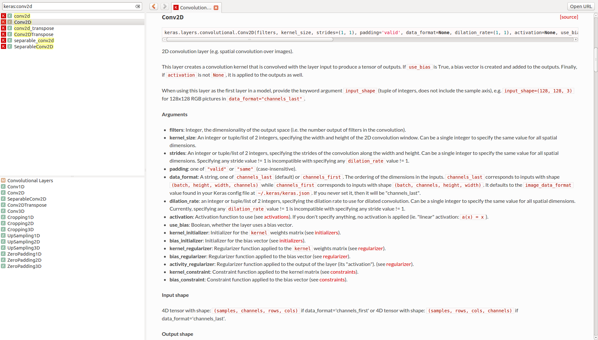

# Keras Docset for Zeal/Dash
* Linux/Windows: [Zeal](https://zealdocs.org/)
* OSX: [Dash](https://kapeli.com/dash)

## Screenshot


## FEED URL
* Add `http://ocf.io/kkweon/docset/Keras.xml` to the feed url in Dash/Zeal

## Dependencies
* You need to install [Dashing](https://github.com/technosophos/dashing)

```bash
go get -u github.com/technosophos/dashing
```

## Build
```bash
bash wget_html.sh # download a html
bash build.sh # preprocess & build dash docset

# Don't run unless the path is same
bash copy_docset.sh # copy the built docset to ~/.local/share/Zeal/Zeal/docsets/
```

## Files
```text
.
├── build.sh
├── copy_docset.sh # check the path before you run this
├── dashing.json
├── README.md
├── theme.css
├── theme_extra.css
└── wget_html.sh
```

## Contributions
* Please feel free to send a PR